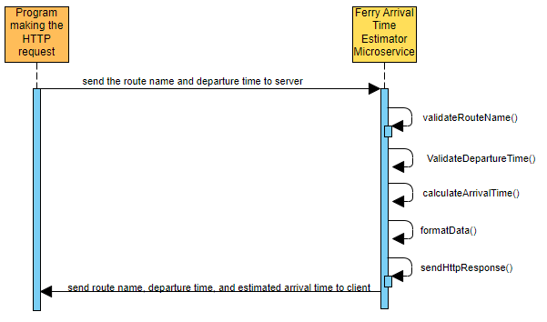

# Ferry Arrival Time Estimator Microservice

This repository contains a HTTP-based microservice that returns the estimated arrival time of a Washington-state ferry given the departure time and the route name. Below are the current routes and their route names:
* "SEA-BR": Seattle to Bremerton
*  "SEA-BI": Seattle to Bainbridge Island
*  "ED-KING": Edmonds to Kingston
*  "MUK-CL": Mukilteo to Clinton

## How To Programmatically Request & Receive Data

After the root URL (http://learningtool-env.eba-gmtn2kim.us-west-2.elasticbeanstalk.com), the page accepts two dynamic parameters. The first is the route name, which are listed above. The second is the departure time in military time. See an example of this below in Python.

```
import json
import urllib.request
from urllib.request import urlopen

with urllib.request.urlopen(
    "http://learningtool-env.eba-gmtn2kim.us-west-2.elasticbeanstalk.com/SEA-BR/1100"
    ) as url:
    data = json.load(url)
    print(data)
    print(data['departureTime'])

CONSOLE:
{'routeName': 'SEA-BR', 'departureTime': '1100', 'estimatedArrivalTime': '1160'}
1100
```

## UML Sequence Diagram



